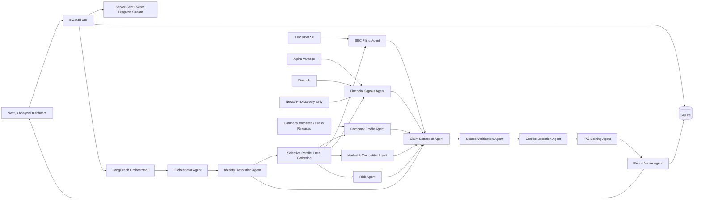

# IPO Lens AI — Verifiable IPO Intelligence Platform

IPO Lens AI is a full-stack, multi-agent financial research platform for IPO-readiness analysis. It is designed around one principle:

> Reliable uncertainty is better than fake confidence.

The app does not act like a generic ChatGPT/Gemini wrapper. It turns research into evidence-backed claims, assigns verification status, detects conflicts, scores confidence, and clearly marks unavailable private-company data as `Not publicly available`.

## Problem Statement

Private-company IPO analysis is noisy. Media reports, investor speculation, funding rumors, and partial public records often get blended into confident summaries. IPO Lens AI separates:

- Official facts from SEC filings and company-controlled sources
- Reported estimates from reputable news
- Unsupported claims from usable evidence
- Conflicting claims from single-source assertions
- Unavailable private-company financials from fabricated numbers

The goal is not to “sound right.” The goal is to show what can be verified.

## Architecture



## What Makes It Different

- Claim-level evidence tracking: every important claim has source IDs, evidence notes, verification status, and confidence score.
- Verification statuses: `verified`, `estimated`, `unsupported`, `not_publicly_available`, `conflicting`.
- Conflict detection: contradictory valuation or financial claims are preserved instead of collapsed into a false single answer.
- Score caps: missing reliable financial data caps IPO readiness at 65; mostly unsupported claims cap it at 50.
- Progress streaming: users see agents complete as the run progresses.
- Failure tolerance: provider failures are logged and shown as degraded confidence, not silent omissions.
- Free-tier-first sources: SEC EDGAR, Alpha Vantage, Finnhub, NewsAPI discovery, company websites, and local SQLite cache.

## Tech Stack

Frontend:

- Next.js
- TypeScript
- TailwindCSS
- lucide-react icons

Backend:

- FastAPI
- Python 3.12
- Pydantic
- SQLAlchemy async
- SQLite MVP storage
- LangGraph-compatible orchestration
- Server-Sent Events

Data providers:

- SEC EDGAR, no API key required, with proper `SEC_USER_AGENT`
- Alpha Vantage, free API key
- Finnhub, free API key
- NewsAPI, free developer key for discovery only
- Fixture providers only for deterministic tests and explicit dev scenarios

## Agent Workflow

The orchestrator dynamically plans the workflow from the prompt.

Examples:

- “Analyze Anthropic IPO readiness” runs company, SEC, financial, market, risk, claim extraction, verification, conflict detection, scoring, and report writing.
- “Only summarize Stripe’s latest filing” can route toward SEC lookup, filing parsing, claim extraction, verification, and summary writing.
- “Compare OpenAI vs Anthropic” can run company/financial/market/risk research for both companies before comparison.

Independent data-gathering agents run concurrently. Evidence reasoning stages run sequentially because claim extraction, verification, conflict detection, and scoring depend on prior output.

Identity resolution runs before parallel data gathering. It searches SEC EDGAR by company name first, then checks SEC ticker mapping as a secondary signal. This avoids treating `company_tickers.json` as the source of truth for IPO candidates that may have filed an S-1/F-1 but not yet started trading, or that may have no public filing at all.

Hard limits:

- Max 3 iterations per agent
- Max 20 workflow steps
- Max 2 tool retries per provider
- Slow or failed sources degrade confidence but do not block completion

## Data Model

Core tables:

- `Company`
- `Source`
- `Claim`
- `ResearchReport`
- `AgentRun`
- `ToolCall`
- `Watchlist`
- `MonitoringAlert`
- `CacheEntry`

The observability model tracks agent duration, token and cost estimates, cache hits, tool failures, and output summaries.

## Agent Tool Policy

The backend exposes an explicit agent-to-tool registry at `GET /api/agents/tools`. This keeps provider usage auditable and prevents the app from silently adding tools to an agent without policy review.

Current policy:

- Identity Resolution Agent: SEC EDGAR company search, SEC ticker mapping.
- Company Profile Agent: Finnhub company profile, Alpha Vantage company overview.
- SEC Filing Agent: SEC EFTS full-text search for S-1/F-1 discovery, SEC submissions.
- Financial Signals Agent: SEC company facts, Alpha Vantage company overview.
- Market & Competitor Agent: Finnhub company profile, NewsAPI discovery.
- Risk Agent: NewsAPI discovery.
- Claim Extraction, Source Verification, Conflict Detection, IPO Scoring, Report Writer: local deterministic tools.

Recommended free/open-source additions:

- SEC XBRL frames API for standardized financial time-series checks.
- NYSE IPO filings page and Nasdaq IPO calendar for exchange-level IPO signals.
- GDELT 2.1 or Google News RSS as no-key news discovery fallbacks.
- CourtListener RECAP for legal/regulatory risk discovery.
- FTC, DOJ, CFPB, and SEC press-release feeds for official regulatory events.
- Wikidata, OpenFIGI, GLEIF LEI, and OpenCorporates for company identity enrichment.

## API

Backend endpoints:

- `POST /api/research`
- `GET /api/research/{run_id}/events`
- `GET /api/agents/tools`
- `GET /api/reports`
- `GET /api/reports/{report_id}`
- `GET /api/reports/{report_id}/claims`
- `GET /api/reports/{report_id}/sources`
- `POST /api/watchlist`
- `GET /api/watchlist`
- `DELETE /api/watchlist/{company_id}`
- `POST /api/watchlist/{company_id}/run-check`
- `GET /api/monitoring-alerts`
- `GET /api/health`

Example:

```bash
curl -X POST http://localhost:8001/api/research \
  -H "Content-Type: application/json" \
  -d '{"company_name":"Anthropic","prompt":"Analyze Anthropic IPO readiness"}'
```

## Local Setup

This repo assumes global tooling is installed:

- Python 3.12+
- Node.js 20+
- npm

Backend:

```bash
cd backend
python3.12 -m venv .venv
source .venv/bin/activate
pip install -e ".[dev]"
uvicorn app.main:app --reload --host 127.0.0.1 --port 8001
```

Frontend:

```bash
cd frontend
npm install
npm run dev
```

Open:

- Frontend: `http://localhost:3000`
- Backend docs: `http://127.0.0.1:8001/docs`

## Environment Variables

Copy `.env.example` to `.env`.

```env
LLM_API_KEY=
LLM_BASE_URL=https://generativelanguage.googleapis.com/v1beta/openai/
LLM_MODEL=gemini-3.5-flash
LLM_CHEAP_MODEL=gemini-3.5-flash
LLM_STRONG_MODEL=gemini-3.5-flash
ALPHA_VANTAGE_API_KEY=
FINNHUB_API_KEY=
NEWS_API_KEY=
SEC_USER_AGENT="IPO Lens AI your-email@example.com"
DATABASE_URL=sqlite+aiosqlite:///./ipo_lens.db
BACKEND_CORS_ORIGINS=http://localhost:3000,http://127.0.0.1:3000
```

The `LLM_*` values are provider-neutral. For Gemini, use a Gemini API key with the shown OpenAI-compatible Gemini base URL. For OpenAI, set `LLM_BASE_URL=https://api.openai.com/v1` and choose OpenAI model names. Legacy `OPENAI_*` variables are still accepted by the backend as a fallback.

SEC requires a descriptive User-Agent. Replace the example email before live use.

## Demo Screenshots

Add screenshots here after running locally:

- `docs/screenshots/dashboard.png`
- `docs/screenshots/research-run.png`
- `docs/screenshots/report.png`

## Testing

```bash
cd backend
pytest
```

Covered scenarios:

- Claim schema validation
- Verification status assignment
- Conflict detection
- IPO score calculation and evidence caps
- Rate limiter behavior
- SQLite cache behavior
- API health and research start
- SSE progress replay
- Fixture-backed Anthropic IPO analysis
- NewsAPI failure with report completion
- Private-company unavailable financials

## Current MVP Status

Implemented:

- Monorepo structure
- FastAPI backend
- SQLAlchemy/Pydantic data model
- Live provider-backed multi-agent workflow
- LangGraph-compatible graph definition
- SSE progress events
- Claim extraction, verification, conflict detection, scoring, report writing
- SEC EDGAR, Alpha Vantage, Finnhub, and NewsAPI client modules
- SQLite cache service and provider rate limiter
- Watchlist and manual “run check now”
- APScheduler-backed daily/weekly watchlist monitoring
- Monitoring alerts for baseline creation, new S-1/F-1 evidence, funding or valuation signals, risk events, score changes, and new conflicts
- Analyst dashboard, live run page, report page, evidence table, badges
- Backend tests

Live by default:

- SEC EDGAR identity, submissions, and company facts
- Alpha Vantage and Finnhub for public-company profile and market data
- NewsAPI discovery with local relevance filtering

Still deterministic or limited:

- Fixture mode remains available only through explicit `use_mock_data=true` or test scenarios
- LLM calls are wired through the provider-neutral client but not required for the deterministic claim pipeline
- Filing parsing beyond SEC submissions/company-facts extraction is still limited

## Limitations

- Private-company financials are often unavailable. IPO Lens AI marks them as `Not publicly available`.
- News is used for discovery and estimates, not final truth.
- Fixture demo data is deterministic and should not be treated as live investment research.
- The MVP uses SQLite and in-process SSE history, which is suitable for local demos but not multi-instance production.
- Scheduled monitoring runs in-process for the local MVP; use an external worker for multi-instance deployments.

## Future Improvements

- Live SEC filing parser for S-1, 10-K, 10-Q, 8-K, and XBRL extraction
- Real provider-backed agents with cache-aware tool calls
- Hosted worker or queue-backed scheduler for production watchlist monitoring
- Redis-backed event stream, cache, and rate limits
- Auth, teams, saved workspaces, and report sharing
- PDF/exportable investor memo
- Deployment templates
- Observability dashboard for agent cost, latency, provider failures, and cache efficiency
